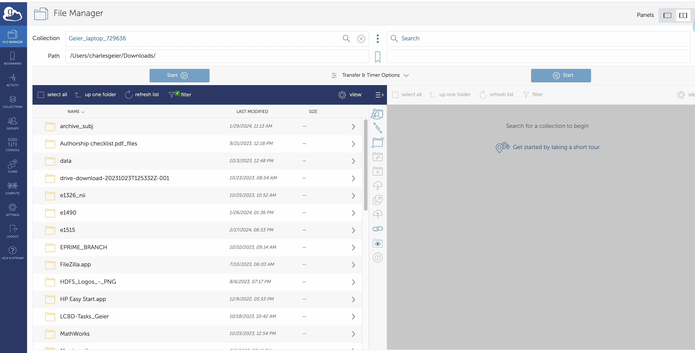
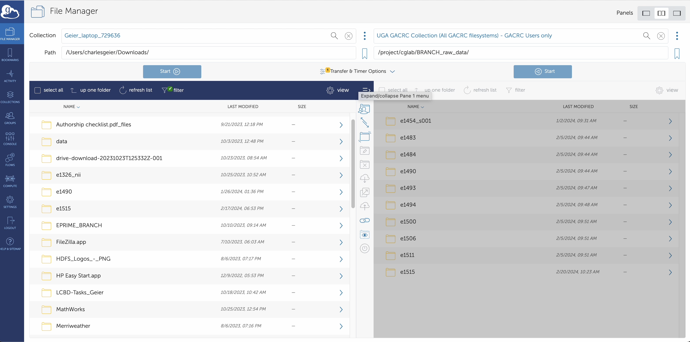

=======================
AFNI processing
=======================

Preprocessing at the individual subject level
=======================

Overview of Common Steps:

1. Download files from BIRC (see Data_Transfer link). 

2. Run 'dcm2niix' to reconstruct 2D images (dicom files) into 3D and 3D+time.

3. Transfer the *.nii and *.json files for the anatomical images (T1) and the functional images (T2*) to specific file locations on GACRC using GlobusConnect Personal. 

4. Run the @SSwarper program to skull-strip and then non-linearly warp and transform the participant's anatomical image to standardized space (Haskins Pediatric Template). 

5. Modify the afni_proc.py script, updating the subject # and the task. 

6. Run afni_proc.py. This will perform standard preprocessing steps (e.g., slice timing correction, motion estimation, etc.) and run an individual-level GLM (using the program 3dDeconvolve). 

7. Evaluate output using QC steps outlined on this site. 

A. Processing KidVid Movies Task
=======================

1. Data from BIRC should be downloaded onto your lab computer (in the video linked below, data are located in the Downloads directory). 

2. Open MRIcron from Applications. 

3. In the menu bar of MRIcron, select "Import" then "Convert DICOM to NIfTI".  A new graphical user interface (GUI) will open. 

4. Drag and drop the data directory from BIRC into GUI to convert the files to *.nii and *.json. 

-----------------------------

.. image:: dcm2niix.png
    :alt: IMAGE ALT TEXT HERE
    :target: https://www.veed.io/view/4458254f-e0ef-4f03-b422-e2539372edfa?panel=share

-----------------------------

5. Next, open GlobusConnect Personal on your computer. 

.. note:: GlobusConnect Personal and GlobusConnect are different. GlobusConnect Personal should be running in the background (on a Mac, it appears in the menu bar). GlobusConnect is accessed online (requires a login). 

6. In the left panel of the GlobusConnect page, select the directory where the data from BIRC was downloaded (which now contains the *.nii and *.json files you just created). On the right side, select the GACRC endpoint and type in the path below. Select the directory by clicking the box next to its name. Then, click 'Start' (blue button under 'Path') under the BIRC file directory to transfer files FROM your computer TO the GACRC.   

.. code-block:: BASH

  /project/cglab/BRANCH_raw_data/

.. note:: This may take up to a few minutes to transfer. 

-----------------------------

-----------------------------

7. Once the transfer is completed, change the path on the left side of your GlobusConnect page to the following path: 

.. code-block:: BASH

  /work/cglab/projects/BRANCH/all_data/fmri/raw/

8. Create a new directory for the participant. Use the naming convention "s[participant_number]".  In this example, the participant is 007, so the directory name should be s007/. Double-click on the directory you just created.  

9. On the right-hand side of GlobusConnect, select all of the *.nii and *.json files that were created for this participant by clicking on the box next to each file name. Then, click the blue 'Start' button to transfer these files to the "s[participant_number]" (e.g., s007) directory. 

-----------------------------

-----------------------------
