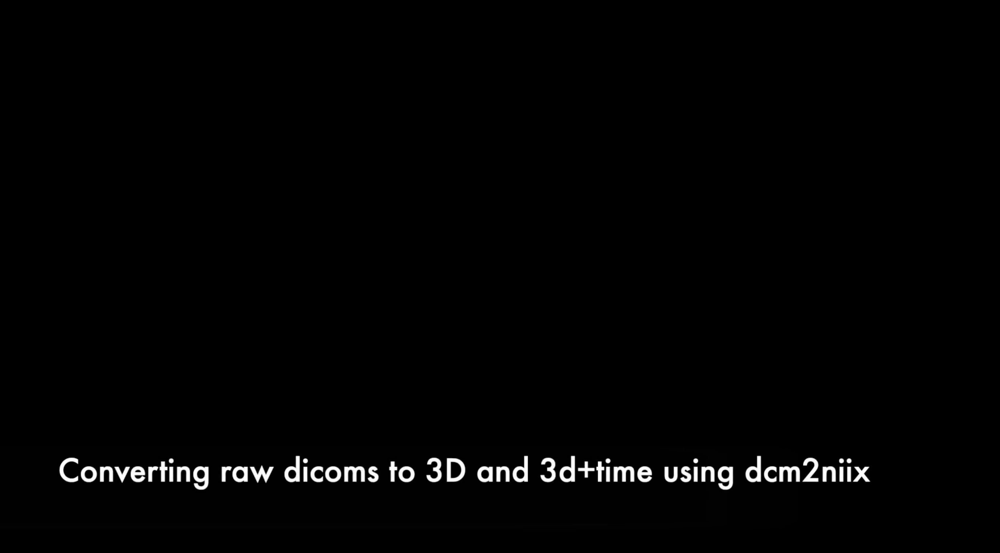

=======================
AFNI processing
=======================

Preprocessing at the individual subject level
=======================

Overview of Common Steps:

1. Download files from BIRC (see Data_Transfer link). 

2. Run 'dcm2niix' to reconstruct 2D images (dicom files) into 3D and 3D+time.

3. Transfer the *.nii and *.json files for the anatomical images (T1) and the functional images (T2*) to specific file locations on GACRC

4. Run the @SSwarper program to skull-strip and then non-linearly warp and transform the participant's anatomical image to standardized space (Haskins Pediatric Template). 

5. Modify the afni_proc.py script, updating the subject # and the task. 

6. Run afni_proc.py. This will perform standard preprocessing steps (e.g., slice timing correction, motion estimation, etc.) and run an individual-level GLM (using the program 3dDeconvolve). 

7. Evaluate output using QC steps outlined on this site. 

A. Processing KidVid Movies Task
=======================

1. Data from BIRC should be downloaded onto your lab computer (in the video linked below, data are located in the Downloads directory). 

2. Open MRIcron from Applications. 

3. In the menu bar of MRIcron, select "Import" then "Convert DICOM to NIfTI".  A new graphical user interface (GUI) will open. 

4. Drag and drop the data directory from BIRC into GUI to convert the files to *.nii and *.json. 

-----------------------------

