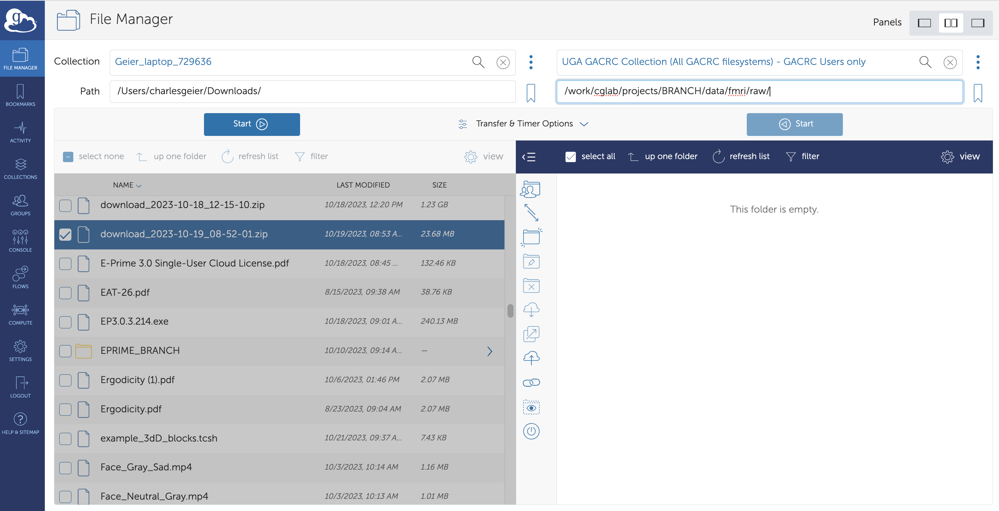

=======================
Data Transfer
=======================

Transferring Raw Imaging Data from BIRC to GACRC 
=======================

Follow these steps:

1. Obtain a link from BIRC with data via email. BRANCH data will be password protected (see Dr. Geier for password)

2. Open the link from BIRC in a web browser and download the data to your computer 

.. raw:: html

    

        <iframe src="https://youtu.be/DKz-VTU0kIY?si=8KIOf7xR3lcQU9O7" frameborder="0" allowfullscreen style="position: absolute; top: 0; left: 0; width: 100%; height: 100%;"></iframe>
    

Click `HERE <https://https://youtu.be/DKz-VTU0kIY?si=8KIOf7xR3lcQU9O7>`__. for a brief YouTube video highlighting this step. 

3. Open Globus Connect Personal and log in

.. figure:: Globus_webpage.png

4. Click on the 'File Manager' button on the left taskbar. Click on Collection (left side) and choose 'Geier_laptop_72936' (or 'YDI_BRANCH' if using the Linux machine in the lab). Find the Downloads directory (or wherever you downloaded the BIRC data) and double-click on it to view the contents. Select the files you want to transfer to GACRC.

5. Click on Collection (right side) and choose 'UGA GACRC Collection (All GACRC filesystems) - GACRC Users only. In 'path', type '/work/cglab/projects/BRANCH/data/fmri/raw' 

6. Click on the blue 'Start' button on the left side to start the transfer of files from your computer to the GACRC. You can check progress by clicking on the 'Activity' button on the left taskbar. You should also receive an email to your UGA account letting you know when the transfer is complete. 

7. Once the transfer is complete, exit Globus Connect Personal by closing the browser tab
