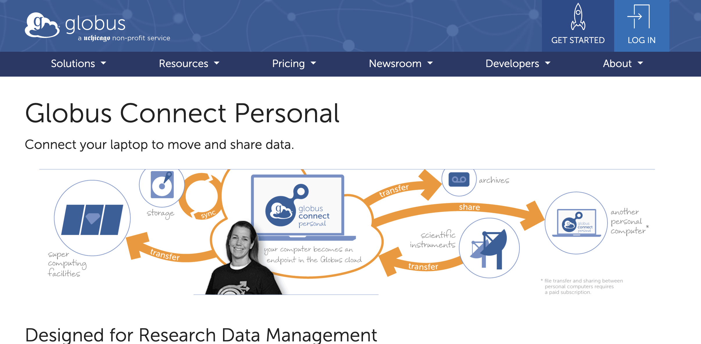

=======================
Data Transfer
=======================

Transferring Raw Imaging Data from BIRC to GACRC 
=======================

Follow these steps:

1. Obtain a link from BIRC with data via email. BRANCH data will be password protected (see Dr. Geier for password)

2. Open the link from BIRC in a web browser and download the data to your computer

.. note:: If you want to view the clip below in a new browser tab, click the middle (scroll wheel) button on your mouse or change your browser settings. Otherwise, be sure to click the back button to return to this page after watching the video.

3. Open Globus Connect Personal and log in with your username and password

.. note:: If you haven't already signed up for a Globus Connect personal, follow set-up instructions linked here https://wiki.gacrc.uga.edu/wiki/Globus_Connect_Personal

4. Click on the 'File Manager' button on the left taskbar. Click on Collection (left side) and choose 'Geier_laptop_72936' (or 'YDI_BRANCH' if using the Linux machine in the lab). Find the Downloads directory (or wherever you downloaded the BIRC data) and double-click on it to view the contents. Select the files you want to transfer to GACRC.

5. Click on Collection (right side) and choose 'UGA GACRC Collection (All GACRC filesystems) - GACRC Users only. In 'path', type '/work/cglab/projects/BRANCH/data/fmri/raw' 

6. Click on the blue 'Start' button on the left side to start the transfer of files from your computer to the GACRC. You can check progress by clicking on the 'Activity' button on the left taskbar. You should also receive an email to your UGA account letting you know when the transfer is complete. 

7. Once the transfer is complete, exit Globus Connect Personal by closing the browser tab
