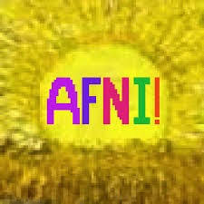
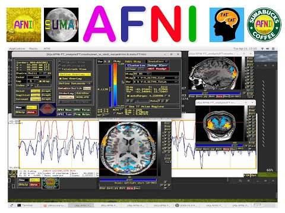

=======================
AFNI Resources
=======================
.. note:: This page is a work-in-progress. If you learn about additional useful resources, please let Dr. Geier and he will add them here! 

1. AFNI Main Page
=======================
Home page for all things AFNI

2. Andy's Brain Book 
=======================
A tremendously useful page with loads of information!

.. image:: AndysBrainPage.png
    :alt: IMAGE ALT TEXT HERE
    :target: https://andysbrainbook.readthedocs.io/en/latest/index.html

3. AFNI Bootcamp Videos
=======================
Short videos on key steps involved in processing fMRI data with AFNI. 

