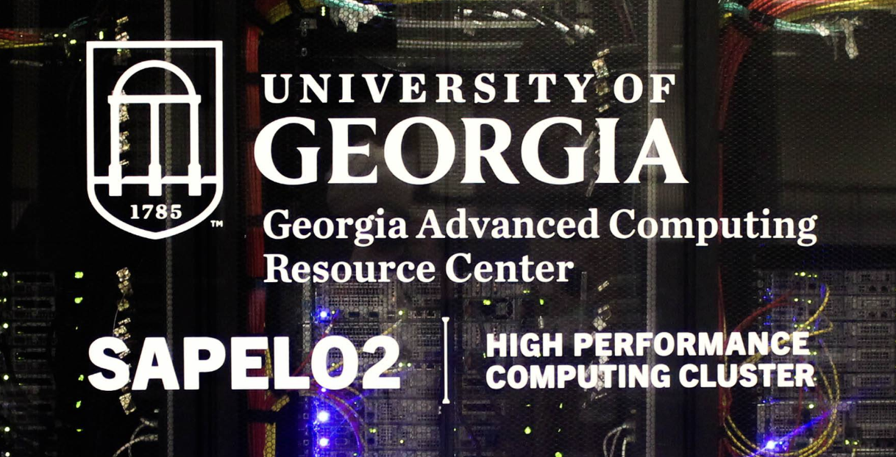
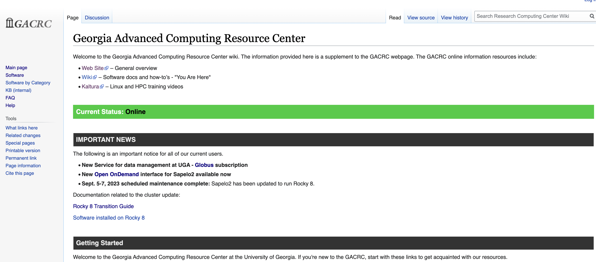

=======================
GACRC Resources
=======================
.. note:: This page is a work-in-progress. If you learn about additional useful resources, please let Dr. Geier know and he will add them here! 

1. GACRC Main Page
=======================
Home page for GACRC

.. note:: There is a link at the bottom of this page to directly connect to Open OnDemand. To learn more about OnDemand, click `HERE <https://wiki.gacrc.uga.edu/wiki/OnDemand>`__. 

2. GACRC Wiki Page
=======================
Check out the GACRC Wiki page for useful how-tos and instructions 

https://wiki.gacrc.uga.edu/wiki/Georgia_Advanced_Computing_Resource_Center
