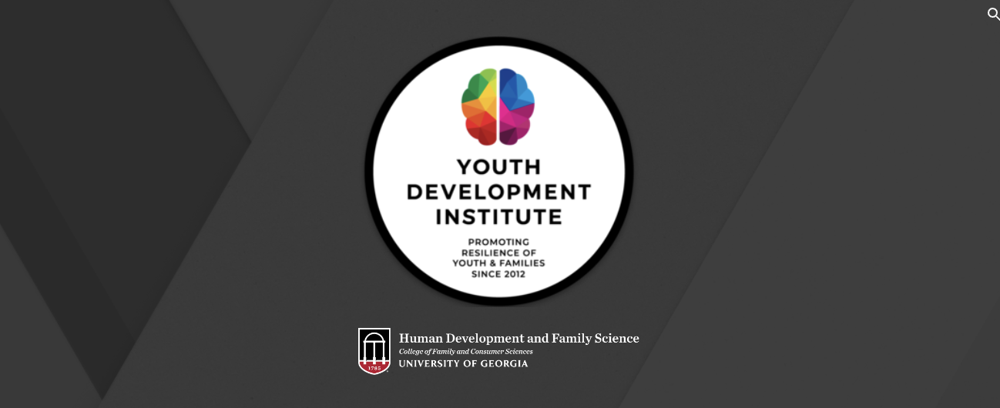

Welcome to the YDI Lab Imaging Analysis Book!
=============================

This book is intended to serve as a central resource for all things related to imaging analysis in the `YDI_Lab <https://www.ydituga.com/home>`__.

.. toctree::
   :maxdepth: 1
   :caption: Data Transfer

   Data_Transfer/BIRCtoGACRC.rst
   
   
.. toctree::
    :maxdepth: 1
    :caption: Useful Links
    
    AFNI/Unix_01_Navigation
    GACRC/Unix_02_CopyRemove
    
    

.. Glossary
.. ==================

.. * :ref:`terms`

.. note::
    This book is under construction. More chapters will be added in the coming weeks; my goal is to have a complete draft by the end of the year.
    
    
